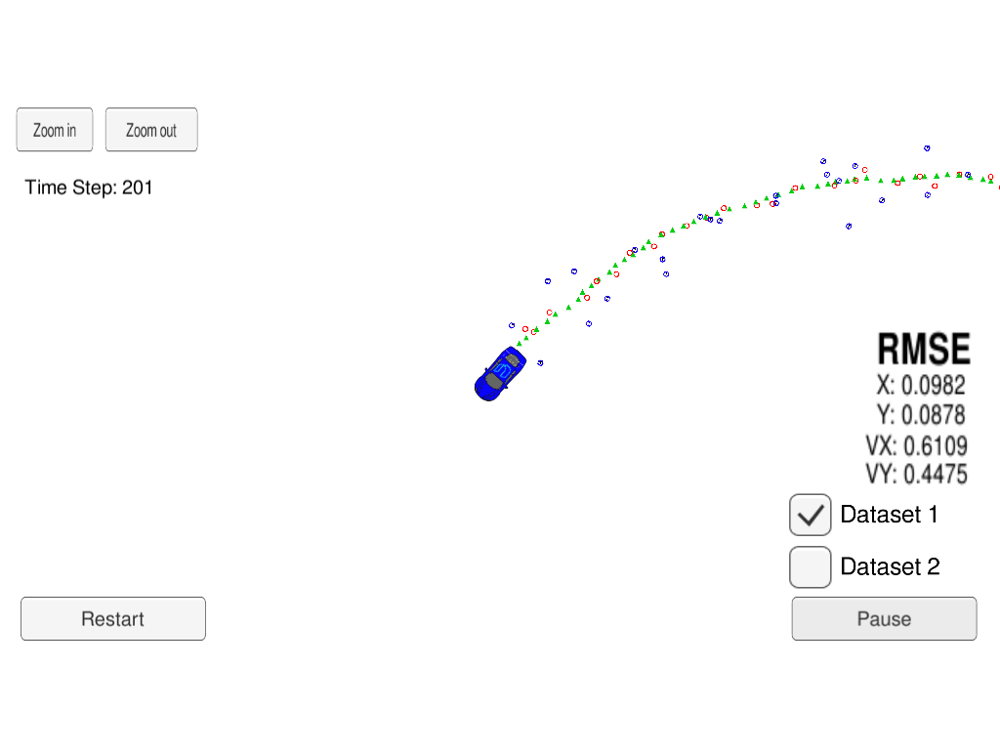
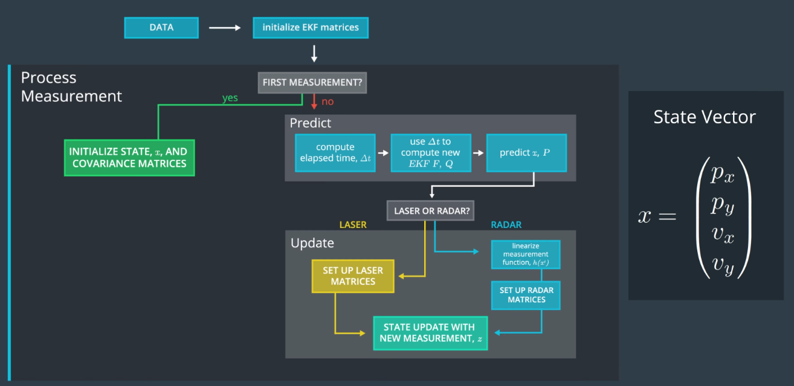

## README

### Technical Report for Fully-Convolutional Network based Follow Me

---



The goals of this project are the following:
* Implement the extended Kalman filter based lidar & radar sensor fusion algorithm
* Achieve the desired precision on the given test dataset

---

### Algorithm Workflow

---

#### General Processing Flow

The general processing flow of algorithm is as follows:



#### First Measurement Processing

For the first measurement:

1. The state variable *previous_timestamp_* is set.
2. State vector *x_* and state covariance matrix *P_* are initialized.

```cpp
// first timestamp:
previous_timestamp_ = measurement_pack.timestamp_;

// first measurement:
if (measurement_pack.sensor_type_ == MeasurementPackage::RADAR) {
    // Convert radar from polar to cartesian coordinates and initialize state.

    // parse radar measurements:
    double ro, theta, ro_dot;

    ro = measurement_pack.raw_measurements_(0);
    theta = measurement_pack.raw_measurements_(1);
    ro_dot = measurement_pack.raw_measurements_(2);

    // position:
    ekf_.x_(0) =  ro * cos(theta);
    ekf_.x_(1) =  ro * sin(theta);
    // velocity:
    ekf_.x_(2) =  ro_dot * cos(theta);
    ekf_.x_(3) =  ro_dot * sin(theta);

    // set initial state covariance matrix according to radar measurement noise:
    ekf_.P_ << R_radar_(0, 0),         0.0000,         0.0000,         0.0000,
                       0.0000, R_radar_(0, 0),         0.0000,         0.0000,
                       0.0000,         0.0000, R_radar_(2, 2),         0.0000,
                       0.0000,         0.0000,         0.0000, R_radar_(2, 2);
}
else if (measurement_pack.sensor_type_ == MeasurementPackage::LASER) {
    // Initialize state from lidar measurements:

    double px, py;

    px = measurement_pack.raw_measurements_(0);
    py = measurement_pack.raw_measurements_(1);

    // position:
    ekf_.x_(0) = px;
    ekf_.x_(1) = py;
    // velocity:
    ekf_.x_(2) = 0.0;
    ekf_.x_(3) = 0.0;

    // set initial state covariance matrix according to lidar measurement noise:
    ekf_.P_ << R_laser_(0, 0),         0.0000,            0.0000,            0.0000,
                       0.0000, R_laser_(0, 0),            0.0000,            0.0000,
                       0.0000,         0.0000, init_velocity_var,            0.0000,
                       0.0000,         0.0000,            0.0000, init_velocity_var;
}
```

#### Predict

First the time elapsed between previous and current timestamps is evaluated.

After the system & process covariance matrices are set, state vector & covariance matrix are updated.

```cpp
// parse current timestamp:
long long current_timestamp = measurement_pack.timestamp_;
long long delta_T = current_timestamp - previous_timestamp_;
previous_timestamp_ = current_timestamp;

// predict:
ekf_.Predict(delta_T / 1000000.0);

/**
 * Prediction Predicts the state and the state covariance
 * using the process model
 * @param delta_T Time between k and k+1 in s
 */
void KalmanFilter::Predict(
  const double delta_T,
  const double noise_ax,
  const double noise_ay
) {
  // set up system matrix F:
  F_(0, 2) = F_(1, 3) = delta_T;

  // set up system noise covariance matrix:
  for (int i = 0; i < 2; ++i) {
	    for (int j = 0; j < 2; ++j) {
	        Q_.block<2, 2>(i << 1, j << 1) << noise_ax, 0.0, 0.0, noise_ay;
	    }
	}
	Q_.block<2, 2>(0, 0) = Q_.block<2, 2>(0, 0) * 1.0/4.0 * pow(delta_T, 4);
	Q_.block<2, 2>(0, 2) = Q_.block<2, 2>(0, 2) * 1.0/2.0 * pow(delta_T, 3);
	Q_.block<2, 2>(2, 0) = Q_.block<2, 2>(2, 0) * 1.0/2.0 * pow(delta_T, 3);
	Q_.block<2, 2>(2, 2) = Q_.block<2, 2>(2, 2) * pow(delta_T, 2);

  // predict state vector:
  x_ = F_ * x_;
  // predict state covariance matrix:
  P_ = F_ * P_ * F_.transpose() + Q_;
}
```

#### Update

Update procedure depends on measurement type.

First the measurement covariance matrix should be set according to measurement type.

Then *UpdateEKF()* is used for radar measurement and *Update()* is used lidar measurement

```cpp
// parse measurementsL
const VectorXd &z = measurement_pack.raw_measurements_;

if (measurement_pack.sensor_type_ == MeasurementPackage::RADAR) {
  // Set up measurement params:
  ekf_.R_ = R_radar_;
  // Radar updates
  ekf_.UpdateEKF(z);
} else {
  // Set up measurement params:
  ekf_.R_ = R_laser_;
  // Laser updates
  ekf_.Update(z);
}

/**
 * Updates the state by using standard Kalman Filter equations
 * @param z The measurement at k+1
 */
void KalmanFilter::Update(const VectorXd &z) {
  // measurement matrix - laser
  H_ = MatrixXd(2, 4);
  H_ << 1.0, 0.0, 0.0, 0.0,
        0.0, 1.0, 0.0, 0.0;

  // Kalman gain:
  MatrixXd Ht_ = H_.transpose();
  MatrixXd K_ = P_ * Ht_ * (H_ * P_ * Ht_ + R_).inverse();

  // update state vector:
  x_ += K_ * (z - H_ * x_);
  // update state covariance matrix:
  P_ = (I_ - K_ * H_) * P_;
}

/**
 * Updates the state by using Extended Kalman Filter equations
 * @param z The measurement at k+1
 */
void KalmanFilter::UpdateEKF(const VectorXd &z) {
  // linearized measurement matrix - radar:
  H_ = tools.CalculateJacobian(x_);
  // predicted observation:
  VectorXd y = tools.CalculatePredictedObservation(x_);

  // Kalman gain:
  MatrixXd Ht_ = H_.transpose();
  MatrixXd K_ = P_ * Ht_ * (H_ * P_ * Ht_ + R_).inverse();

  // update state vector:
  VectorXd error = z - y;
  if (error(1) > M_PI) {
    error(1) = 2*M_PI - error(1);
  } else if (error(1) < -M_PI){
    error(1) = 2*M_PI + error(1);
  }
  x_ += K_ * error;
  // update state covariance matrix:
  P_ = (I_ - K_ * H_) * P_;
}
```

---

### Tracking Accuracy

---

Algorithm performance on dataset 1 & 2 are as follows:

|  Dataset |              Accuracy             |
|:--------:|:---------------------------------:|
| Dataset1 | [0.0966, 0.0848, 0.4482, 0.4232]  |
| Dataset2 |  [0.0829, 0.0964, 0.4766, 0.4633] |

Which meets the required accuracy
